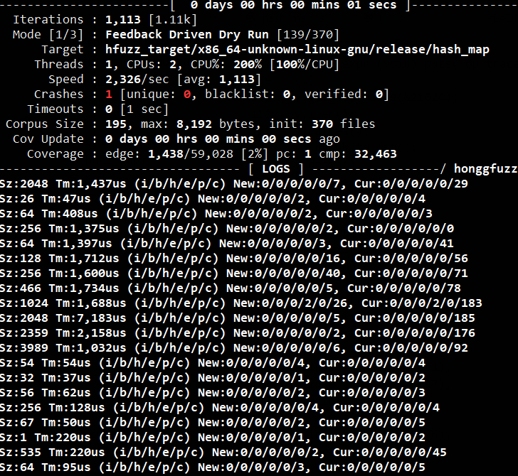

# Debugging

The `Op` struct implements the `Display` trait that produces semi-valid (usually valid) Rust code equivalent to the operation (e.g. `v.insert(0, 2);` for an insert operation of a HashMap). This can be very usefully employed when debugging an actual crash found by the fuzzer, such that from the debugger we have access to an almost compile-ready operation trace that led to the given crash. See [these two lines](examples/src/hash_map.rs#L197-L198) for an example of how this trace is built up during the fuzzing process:

https://github.com/jakubadamw/rutenspitz/blob/40cf9660493e3e96e63a7d3da296665d59f8bef6/examples/src/hash_map.rs#L197-L198

Such a trace can later be used as a starting point for an investigation into the root cause of a bug found by the fuzzing.

Say, we run the `hash_map` fuzz test:

```sh
cargo hfuzz run hash_map
```

And it finds a crash.



We run it again, but this time through the debugger.

```sh
cargo hfuzz run-debug hash_map hfuzz_workspace/hash_map/*fuzz
```

As is known, the fuzzing tests must be deterministic with regards to the bytes they're fed with. In the case of the hash map test, the random seed it uses for the hasher initialisation is also derived from the input bytes. Because of it, it is indeed deterministic and we're able to reproduce the crash when running it again (with the saved snapshot of the fuzzing data as an input) from the debugger.

```gdb
HFUZZ_DEBUGGER=lldb cargo hfuzz run-debug hash_map hfuzz_workspace/hash_map/*fuzz
/usr/bin/ld.gold
    Finished dev [unoptimized + debuginfo] target(s) in 0.09s
(lldb) target create "hfuzz_target/x86_64-unknown-linux-gnu/debug/hash_map"
Current executable set to '/home/jakubw/rutenspitz/hfuzz_target/x86_64-unknown-linux-gnu/debug/hash_map' (x86_64).
(lldb) b rust_panic
Breakpoint 1: where = hash_map`rust_panic + 19 at panicking.rs:575:9, address = 0x00000000001689a3
(lldb) r
Backtrace (most recent call first):
  File "/home/jakubw/rutenspitz/examples/src/hash_map.rs", line 180, in hash_map::op::Op<K,V>::execute_and_compare
    assert_eq!(tested.len(), model.len());
  File "/home/jakubw/rutenspitz/examples/src/hash_map.rs", line 200, in hash_map::fuzz_cycle
    op.execute_and_compare(&mut model, &mut tested);
  File "/home/jakubw/rutenspitz/examples/src/hash_map.rs", line 211, in hash_map::main::{{closure}}
    let _ = fuzz_cycle(data);
  File "/home/jakubw/.cargo/registry/src/github.com-1ecc6299db9ec823/honggfuzz-0.5.49/src/lib.rs", line 329, in honggfuzz::fuzz
    closure(&mmap);
  File "/home/jakubw/rutenspitz/examples/src/hash_map.rs", line 210, in hash_map::main
    fuzz!(|data: &[u8]| {

The application panicked (crashed).
  assertion failed: `(left == right)`
    left: `11`,
   right: `10`
in examples/src/hash_map.rs, line 180
thread: main
Process 3272921 stopped
* thread #1, name = 'hash_map', stop reason = breakpoint 1.1
    frame #0: 0x00005555556bc9a3 hash_map`rust_panic at panicking.rs:575:9

Process 3274281 launched: '/home/jakubw/rutenspitz/hfuzz_target/x86_64-unknown-linux-gnu/debug/hash_map' (x86_64)
(lldb) bt
* thread #1, name = 'hash_map', stop reason = breakpoint 1.1
  * frame #0: 0x00005555556bc9a3 hash_map`rust_panic at panicking.rs:575:9
    frame #1: 0x00005555556bc95a hash_map`std::panicking::rust_panic_with_hook::hb7ad549fb7110aed at panicking.rs:545:5
    frame #2: 0x00005555556bc4cb hash_map`rust_begin_unwind at panicking.rs:437:5
    frame #3: 0x00005555556bc43b hash_map`std::panicking::begin_panic_fmt::hb90a7d6c31a2e780 at panicking.rs:391:5
    frame #4: 0x00005555555a2cde hash_map`hash_map::op::Op$LT$K$C$V$GT$::execute_and_compare::h76253904ace04422(self=Op<u16, u16> @ 0x00007fffffffdc20, model=0x00007fffffffdb08, tested=0x00007
fffffffdb20) at hash_map.rs:180:9
    frame #5: 0x000055555559d3a3 hash_map`hash_map::fuzz_cycle::h1b91651e06656ad8(data=(data_ptr = "\x12\x8ek, length = 3757)) at hash_map.rs:200:9
    frame #6: 0x000055555558ddf3 hash_map`hash_map::main::_$u7b$$u7b$closure$u7d$$u7d$::h8a51d7c412d8f5fe((null)=closure-0 @ 0x00007fffffffdc80, data=(data_ptr = "\x12\x8ek, length = 3757)) at
 hash_map.rs:211:21
    frame #7: 0x00005555555769df hash_map`honggfuzz::fuzz::he52927812c14de56(closure=closure-0 @ 0x00007fffffffddf0) at lib.rs:329:5
    frame #8: 0x000055555559d45e hash_map`hash_map::main::h6d8216e6d238caab at hash_map.rs:210:9
    frame #9: 0x00005555555a9e2b hash_map`std::rt::lang_start::_$u7b$$u7b$closure$u7d$$u7d$::h5f0897ab382e4c10 at rt.rs:67:34
    frame #10: 0x00005555556bcca3 hash_map`std::rt::lang_start_internal::heeef42c9aa2e7f9b [inlined] std::rt::lang_start_internal::_$u7b$$u7b$closure$u7d$$u7d$::hac40205b257c5248 at rt.rs:52:1
3
    frame #11: 0x00005555556bcc98 hash_map`std::rt::lang_start_internal::heeef42c9aa2e7f9b [inlined] std::panicking::try::do_call::h28f2e69fa50926c2 at panicking.rs:348
    frame #12: 0x00005555556bcc98 hash_map`std::rt::lang_start_internal::heeef42c9aa2e7f9b [inlined] std::panicking::try::hb2c13e7a9a68aa8b at panicking.rs:325
    frame #13: 0x00005555556bcc98 hash_map`std::rt::lang_start_internal::heeef42c9aa2e7f9b [inlined] std::panic::catch_unwind::hb5c1b6ef4106c1a1 at panic.rs:394
    frame #14: 0x00005555556bcc98 hash_map`std::rt::lang_start_internal::heeef42c9aa2e7f9b at rt.rs:51
    frame #15: 0x00005555555a9e07 hash_map`std::rt::lang_start::h3f011cb1aa45d1f4(main=(hash_map`hash_map::main::h6d8216e6d238caab at hash_map.rs:206), argc=1, argv=0x00007fffffffe0d8) at rt.r
s:67:5
    frame #16: 0x000055555559d48a hash_map`main + 42
    frame #17: 0x00007ffff7df20b3 libc.so.6`__libc_start_main + 243
    frame #18: 0x00005555555760ae hash_map`_start + 46
```

We now look for the top-most frame that's located in the `fuzz_cycle` function. It's frame number 5.

```gdb
frame #5: 0x000055555559d3a3 hash_map`hash_map::fuzz_cycle::h1b91651e06656ad8(data=(data_ptr = "\x12\x8ek, length = 3757)) at hash_map.rs:200:9
```

We select it.

```gdb
(lldb) frame select 5
frame #5: 0x000055555559d3a3 hash_map`hash_map::fuzz_cycle::h1b91651e06656ad8(data=(data_ptr = "\x12\x8ek, length = 3757)) at hash_map.rs:200:9
   197      while let Ok(op) = <op::Op<u16, u16> as Arbitrary>::arbitrary(&mut ring) {
   198          #[cfg(fuzzing_debug)]
   199          _op_trace.push_str(&format!("{}\n", op.to_string()));
-> 200          op.execute_and_compare(&mut model, &mut tested);
   201      }
   202
   203      Ok(())
```

And we're able to print out the op trace:

```
(lldb) expr (void) puts(_op_trace.vec.buf.ptr.pointer)
(…)
v.get_key_value(&21624);
v.iter();
v.values();
v.shrink_to_fit();
v.drain();
v.values_mut();
v.shrink_to_fit();
v.values();
v.insert(14415, 18726);
v.insert(30298, 60880);
v.iter_mut();
v.values_mut();
v.get_mut(&5287);
v.contains_key(&1056);
v.values();
v.values_mut();
v.insert(42387, 40681);
v.insert(64012, 21197);
v.values_mut();
v.values();
v.insert(20656, 60976);
v.contains_key(&48925);
v.values();
v.remove(&45196);
v.insert(52201, 27410);
```

Which we can copy out or write out to a file (using, for example, https://github.com/4iar/lldb-write).
